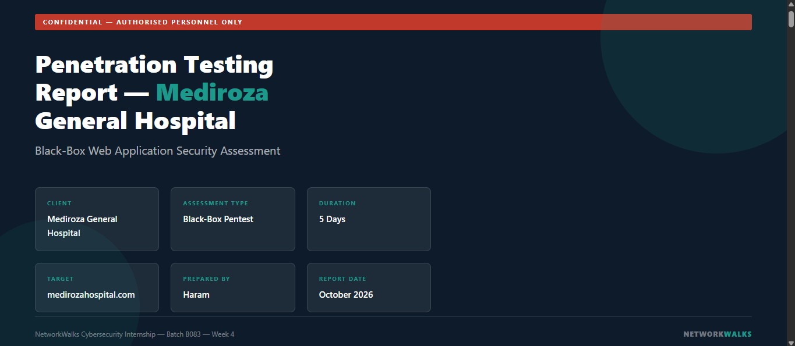
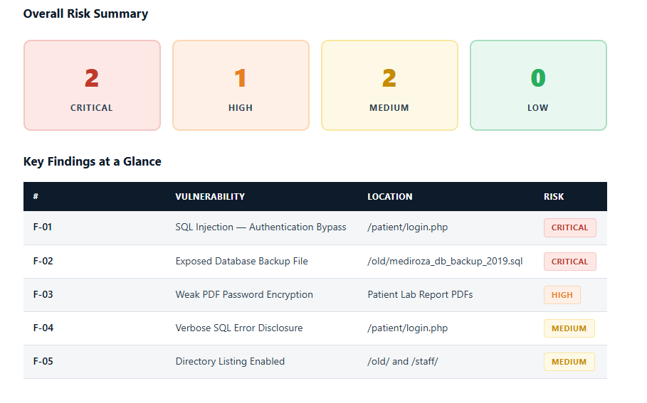
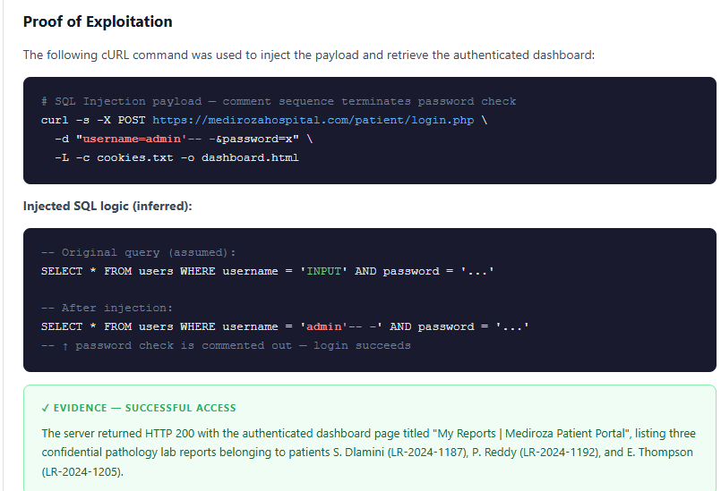

# NetworkWalks Cybersecurity Internship – Week 4

This repository documents my **Week 4 practical work** completed during my Cybersecurity Internship at **NetworkWalks**.

## 🛡️ Week 4 — Web Application Penetration Testing

The week focused on performing a structured **black-box web application security assessment** in an authorized and controlled environment.

### Assessment Overview

- **Assessment Type:** Black-Box Web Application Penetration Test
- **Target:** Mediroza General Hospital (authorized training environment)
- **Duration:** 5 Days
- **Methodology:** Reconnaissance → Enumeration → Vulnerability Identification → Controlled Exploitation → Risk Assessment → Remediation
- **Authorization:** Testing performed under written authorization
- **Environment:** Controlled educational assessment

## 🔍 Activities Performed

### 1. Reconnaissance & Enumeration

- Performed passive and active reconnaissance.
- Identified web technologies and exposed services.
- Enumerated directories and accessible endpoints.
- Reviewed the application's externally visible attack surface.

### 2. Authentication Security Testing

- Tested the patient portal login functionality.
- Identified an authentication-related SQL injection vulnerability in the authorized environment.
- Validated the finding through controlled testing.

### 3. Sensitive File Exposure

- Investigated publicly accessible directories.
- Identified an exposed database backup as a sensitive information disclosure issue.
- Assessed the potential impact of exposed staff and organizational data.

### 4. PDF & Password Security Testing

- Reviewed password-protected PDF documents obtained during the authorized assessment.
- Tested the strength of PDF password protection using password-recovery techniques.
- Documented the security impact of weak passwords protecting sensitive information.

### 5. Error & Configuration Review

- Identified verbose database error messages.
- Checked directory listing configuration.
- Evaluated how these issues could assist further attack attempts.

## 🧰 Tools Used

- **Nmap** — Port scanning and service enumeration
- **WhatWeb** — Web technology fingerprinting
- **Gobuster** — Directory and endpoint enumeration
- **cURL** — HTTP request testing
- **WHOIS** — Domain reconnaissance
- **pdfcrack** — Authorized PDF password-recovery testing
- **pdf2john** — PDF hash extraction
- **Hashcat** — Password/hash security testing

## 📊 Findings Identified

The assessment documented the following categories of security weaknesses:

| Finding | Category | Risk |
|---|---|---|
| F-01 | SQL Injection / Authentication Bypass | Critical |
| F-02 | Exposed Database Backup | Critical |
| F-03 | Weak PDF Password Protection | High |
| F-04 | Verbose SQL Error Disclosure | Medium |
| F-05 | Directory Listing Enabled | Medium |

## 🖼️ Report Evidence

A sample visual from the penetration testing report is included below:





## 📄 Penetration Testing Report

The detailed HTML penetration testing report is included in the repository under the `report` folder.

```text
report/
├── 1.png
└── Penetration-Testing-Report-Mediroza.html
```

## 🛠️ Key Remediation Recommendations

- Use prepared statements / parameterized queries to prevent SQL injection.
- Validate and securely handle all user-supplied input.
- Remove database backups and other sensitive files from publicly accessible web directories.
- Store backups outside the web root and protect them with strong encryption.
- Enforce strong, unique passwords for sensitive documents.
- Avoid legacy encryption standards where stronger alternatives are available.
- Disable detailed error messages in production environments.
- Disable unnecessary directory listing.
- Perform regular security assessments and follow-up testing after remediation.

## 📁 Repository Structure

```text
NetworkWalks-Internship-Week4-Penetration-Testing/
│
├── README.md
│
├── report/
│   ├── 1.png
│   └── Penetration-Testing-Report-Mediroza.html
│
├── reconnaissance/
├── enumeration/
├── web-security-testing/
├── password-security/
├── findings/
└── remediation/
```

> **Note:** Publicly shared materials should contain only sanitized screenshots and information. Do not publish real credentials, passwords, patient information, national IDs, salary records, database backups, private client data, or sensitive exploit evidence.

## 🎯 Learning Outcomes

Through this week's work, I gained practical exposure to:

- Web application penetration-testing methodology
- Reconnaissance and attack-surface enumeration
- Authentication security testing
- SQL injection identification
- Sensitive file exposure analysis
- Password-security assessment
- Error-message and configuration review
- Vulnerability risk classification
- Writing professional penetration-testing findings
- Translating technical findings into remediation recommendations

## ⚠️ Ethical & Legal Notice

All security testing documented in this repository was performed in an **authorized, controlled educational environment**.

The techniques described are intended for **authorized security testing, training, and defensive purposes only**. Never test systems, applications, domains, or data without explicit permission from the owner.

## 👨‍💻 Internship

**NetworkWalks Cybersecurity Internship — Batch B083**  
**Week 4: Web Application Penetration Testing**

Special thanks to **Waqas Karim (CCIE)** for his guidance and support throughout the internship.
